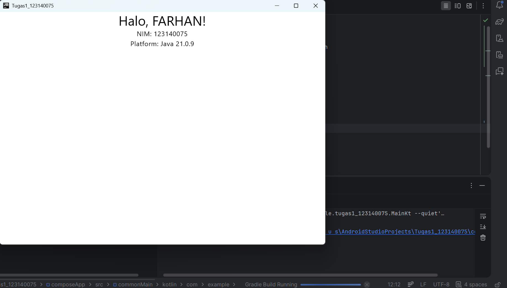

# Tugas Praktikum Pengembangan Aplikasi Mobile - Minggu 1

Tugas ini merupakan implementasi dasar **Kotlin Multiplatform (KMP)** menggunakan framework **Compose Multiplatform** untuk menampilkan identitas mahasiswa dan mendeteksi platform yang digunakan.
* **Nama:** FARHAN
* **NIM:** 123140075
* **Kelas:** PAM - RA

## Deskripsi Tugas
Berikut adalah poin-poin yang telah diselesaikan dalam tugas ini:
1. **Setup Environment**: Mengonfigurasi Android Studio dan Plugin KMP.
2. **Proyek KMP**: Membuat proyek baru dengan template Compose Multiplatform.
3. **Modifikasi Hello World**:
    - Mengubah teks menjadi "Halo, FARHAN!".
    - Menambahkan NIM "123140075" di bawah nama.
    - Menampilkan platform yang sedang digunakan (Java/Desktop).
4. **Platform**: Aplikasi dijalankan pada platform **Desktop (JVM)**.

## Screenshot Aplikasi

